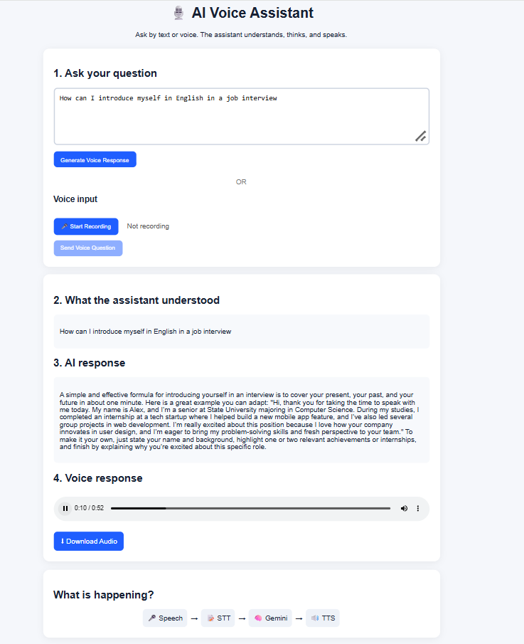
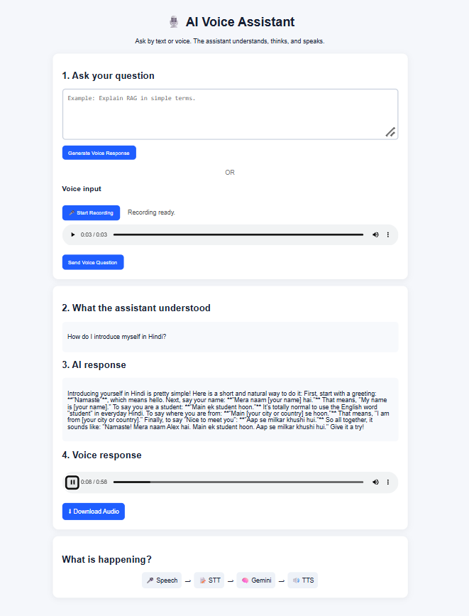

# AI Language Speech Tutor 🎙️

An AI-powered language and speech tutor that allows users to interact with an AI using text or voice.

## Demo

### Text Mode



The user can ask a language-related question through text. The application generates an AI response and converts the response into speech.

### Voice Mode



The user can speak a question using the microphone. The application converts speech to text, generates an AI response, and provides the response as audio.

## What It Does

The application supports two interaction modes.

### Text Mode

```text
Text Input
    ↓
Gemini AI
    ↓
AI Response
    ↓
Text-to-Speech
    ↓
Audio Response
```

### Voice Mode

```text
Microphone
    ↓
Speech-to-Text
    ↓
Gemini AI
    ↓
AI Response
    ↓
Text-to-Speech
    ↓
Audio Response
```

Users can ask questions related to language learning, communication, and everyday conversation using either text or voice.

## Key Features

- 🎤 Voice input
- 📝 Text input
- 🤖 Gemini-powered AI responses
- 🗣️ Speech-to-text
- 🔊 Text-to-speech
- ▶️ Audio playback
- ⬇️ Audio download
- 🌐 Language-learning and communication questions
- 💻 Simple web interface

## Technology Stack

- Python
- FastAPI
- JavaScript
- HTML
- CSS
- Google Gemini
- Speech-to-Text
- Text-to-Speech

## Project Structure

```text
ai-language-speech-tutor/
│
├── app/
├── static/
├── text-mode.png
├── voice-mode.png
├── .gitignore
├── LICENSE
├── README.md
└── requirements.txt
```

## How It Works

The application follows a simple AI voice pipeline:

```text
User Input
    ↓
Speech-to-Text (for voice input)
    ↓
Gemini AI
    ↓
Generated Response
    ↓
Text-to-Speech
    ↓
Spoken Response
```

For text input, the speech-to-text step is skipped.

## Run Locally

### 1. Clone the Repository

```bash
git clone https://github.com/kavyabaswa555/ai-language-speech-tutor.git
```

### 2. Open the Project Folder

```bash
cd ai-language-speech-tutor
```

### 3. Create a Virtual Environment

```bash
python -m venv .venv
```

### 4. Activate the Virtual Environment

#### Windows

```bash
.venv\Scripts\activate
```

#### Linux / macOS

```bash
source .venv/bin/activate
```

### 5. Install Dependencies

```bash
pip install -r requirements.txt
```

### 6. Configure the API Key

Create a `.env` file and add your Gemini API key:

```text
GEMINI_API_KEY=your_api_key_here
```

**Do not upload your actual API key to GitHub.**

### 7. Start the Application

```bash
uvicorn app.main:app --reload
```

### 8. Open the Application

Open:

```text
http://127.0.0.1:8000
```

## Example Language Questions

The tutor can be used for questions such as:

- How can I introduce myself in English in a job interview?
- How do I introduce myself in Hindi?
- Teach me some common English phrases for daily conversation.
- Correct this sentence: I am studying in third year.

## Learning Flow

```text
🎤 Speech
   ↓
📝 Speech-to-Text
   ↓
🤖 Gemini AI
   ↓
🔊 Text-to-Speech
   ↓
🗣️ Spoken Response
```

## Future Improvements

- 🌐 Support for more languages
- 💬 Conversation history
- 📚 RAG-based learning resources
- 🎯 Personalized language practice
- 🗣️ Selectable voices
- 📊 Learning progress tracking
- ⚡ Streaming responses

## Team

Developed as a collaborative AI project.

## License

This project is licensed under the MIT License.
